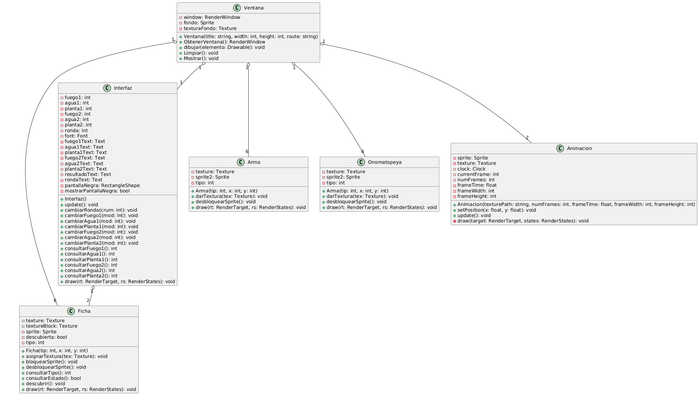

# KIT-RATE

## Introduction

**Kit-Rate** is an exciting game of strategy and fun that takes the classic concept of "rock, paper, scissors" to a new level. However, instead of the classic options, players use *Fire, Water, and Plant*  to compete. Immerse yourself in a world where two adorable cats face off in an epic duel of natural elements.

## User Manual

The game is visually appealing and designed to keep players entertained with its dynamic gameplay and charming graphics. Players challenge each other using three fundamental elements:

🔥 Fire
💧 Water
🌿 Plant

The rules of combat are simple but strategic:
- Fire burns Plant
- Plant absorbs Water
- Water extinguishes Fire

### How To Play

1. **Kick-off:** At the beginning, players will see their cards on the screen.

2. **Each player's turn:**
    - Player 1 selects a card by clicking on it.
    - Player 2 selects his card afterward.

3. **Victory evaluation:** Once the cards have been selected, the game evaluates the winner of the round according to the victory conditions:

    - Victory by domain: A player collects three cards of the same category (e.g., three Fire cards).
    - Victory by equilibrium: A player collects one card of each category (Fire, Water, and Plant).

4. **Track progress:** The game updates scores and displays the current status.

## Screenshots

- Principal **menu**.

- **Combat** image.

- **Winner** text.

## Objective

The objective is simple: beat your opponent by choosing the element that destroys him. Each round is an exciting battle of pure luck.

## Characters

- Grey Cat: Cunning and mysterious strategist.
- Orange Cat: Brave and determined competitor.

## Features

- Interactive and dynamic gameplay.
- Easy to learn, hard to master gameplay.
- Great for all ages.
- Perfect for fun times with friends.

## Compile

To compile the project, execute the following command:

>make run--

## Dependencies

1. **SFML:** (version 2.5 or higher)
    - Download: [https://www.sfml-dev.org/](https://www.sfml-dev.org/)
    - Install according to your OS:
        - **Linux:** sudo apt-get install libsfml-dev.
        - **Windows:** Download and set up the library for your compiler.
        - **macOS:** brew install sfml.

2. **C++ Compiler:** (supports C++17 or higher)
    - Examples: GCC, Clang, or MSVC.

3. **Make:** (optional, for using the provided makefile)

## Diagram

## Contact Us

For questions or feedback, feel free to reach out to:

- Email: a23310331l@ceti.mx / a23310341l@ceti.mx
- GitHub: rubenmedgon / Matipro331

## FAQ

- *Does the game have difficulty levels?*
Currently, the game is designed for two human players. 

- *Is it possible to change the cat images or backgrounds?*
Yes, you can modify the images in the ./assets folder. Make sure to use files with the same name and format to avoid errors.

- *What happens if players click outside the card area?*
The click will simply not be registered. The game will continue to wait for a valid action.

## License

This project is licensed under the MIT License. See the license file for details.

Enjoy playing **Kit-Rate**!